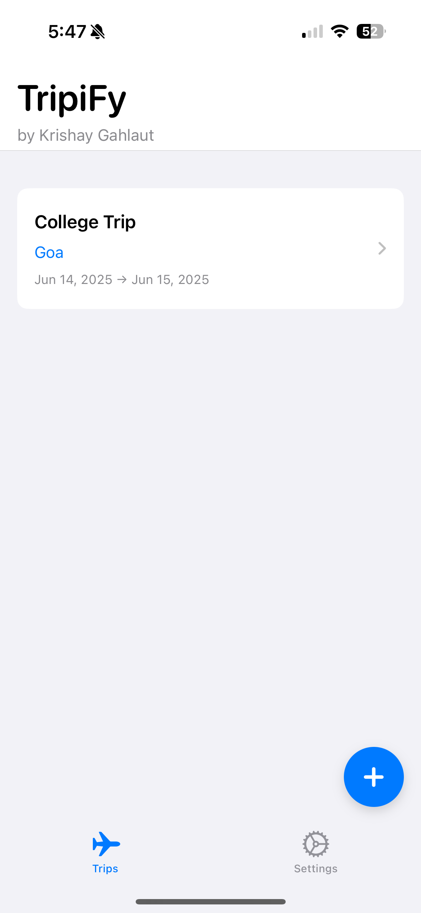
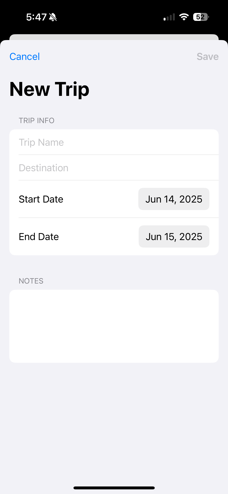
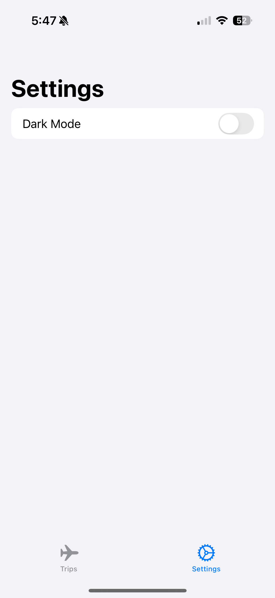
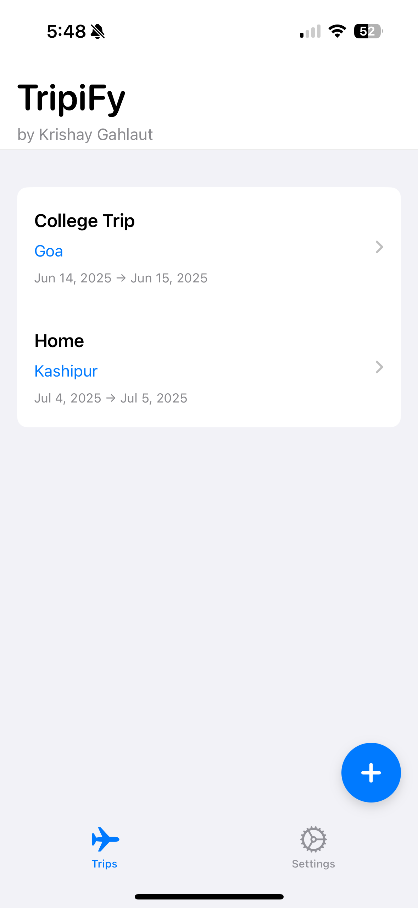
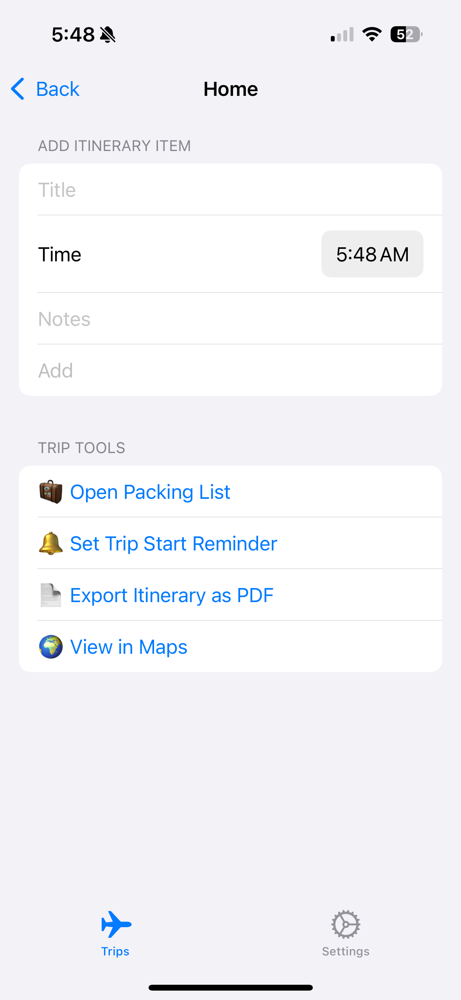

# 🌍 TripiFy

**SwiftUI-based Trip Planner App**  
Plan, manage, and get reminders for your trips — all in one sleek iOS app.


---

## ✨ Features

- 📅 Add and view trips with destination and date range
- 📝 Plan daily itinerary items (with time + notes)
- 🔔 Set local notifications for trip start reminders
- 📄 Export itinerary as a professional PDF
- 🧳 Open built-in packing list for each trip
- 🗺️ View trip location in Apple Maps
- 🌙 Light/Dark mode toggle

---

## 🖼️ Screenshots


<p float="left">
  
  
  
  
  
  
  
</p>
---

## 🛠 Tech Stack

- **SwiftUI**
- **MVVM Architecture**
- **UserNotifications**
- **PDFKit**
- **UIKit bridge for activity sharing**
- **AppStorage + EnvironmentObject**

---

## 🧪 How to Run

1. Clone this repo  
   ```bash
   git clone https://github.com/krishaygahlaut/TripiFy.git
   cd TripiFy
